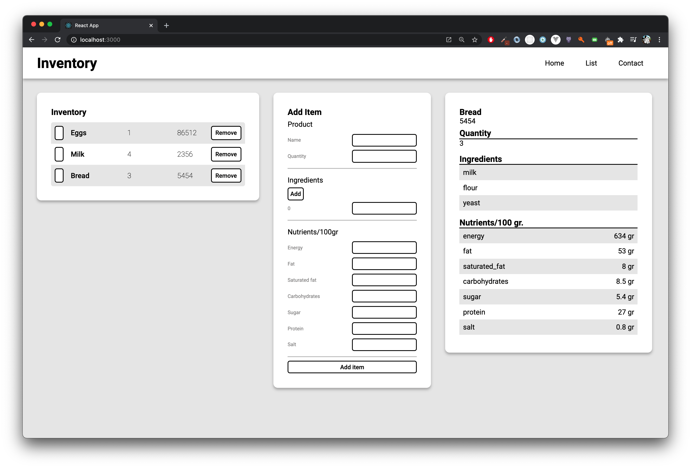

# Inventory Application

This application is for your own inventory. You can see an overview of your inventory, you can add and remove some products from your list. 

#### Framework
The framework I working with is ReactJS and the application is build up with components.  

### Wish list

- [x] List of products
- [x] Add product
	- [x] Ingredient loop
	- [x] Update state
- [x] Remove product
- [x] Product details
- [ ] Database connection (MongoDB)
- [ ] Error handling add form
- [ ] Different collections of products 
- [ ] NextJS 